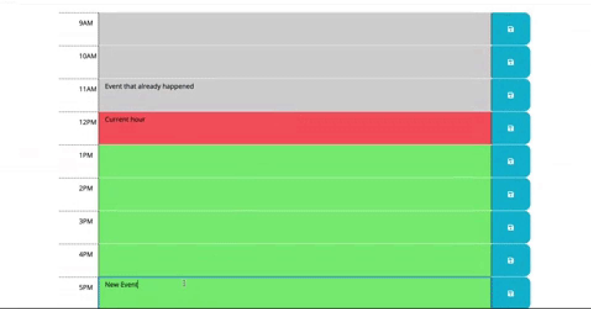
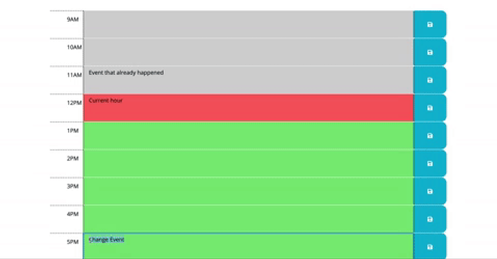

Work Day Scheduler
=====
By Weng Fei Fung. Schedule your work day on a convenient one page app.

You schedule events for the day. It'll break down the day into work hours which are color-coded to indicate past, present, or future. You can easily add events to hours and save them. The events will load back up the next time you open the app.

Live Demo
---
[Open work calendar app](//Siphon880gh.github.io/work-day-scheduler)

Screenshots
---
Color-coded past, present, future

You can change task name (notice bottom)

That task name changed (notice bottom)
